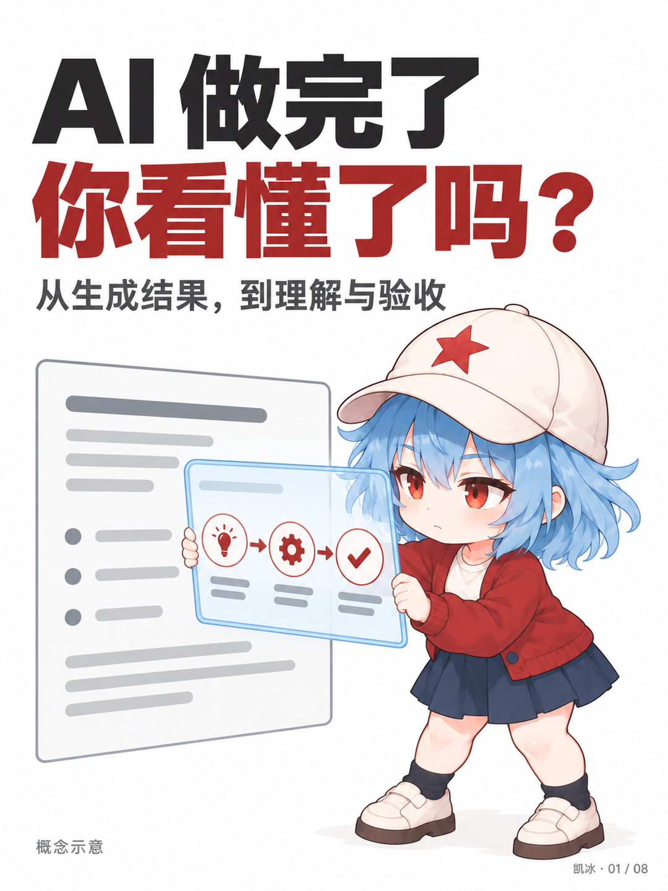
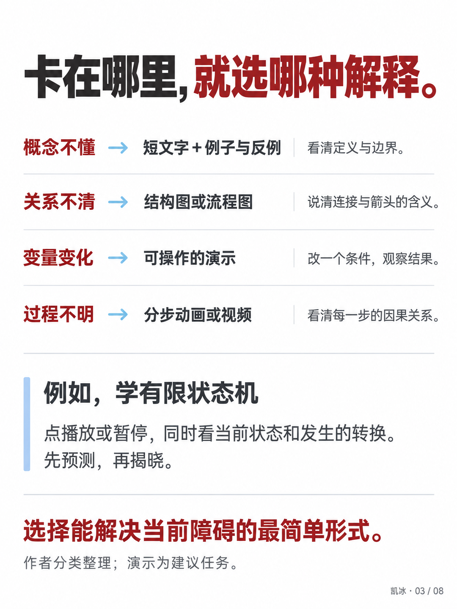
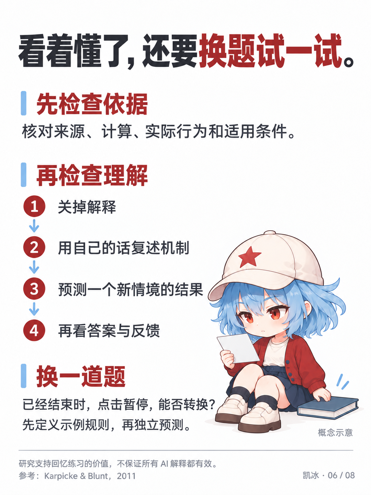
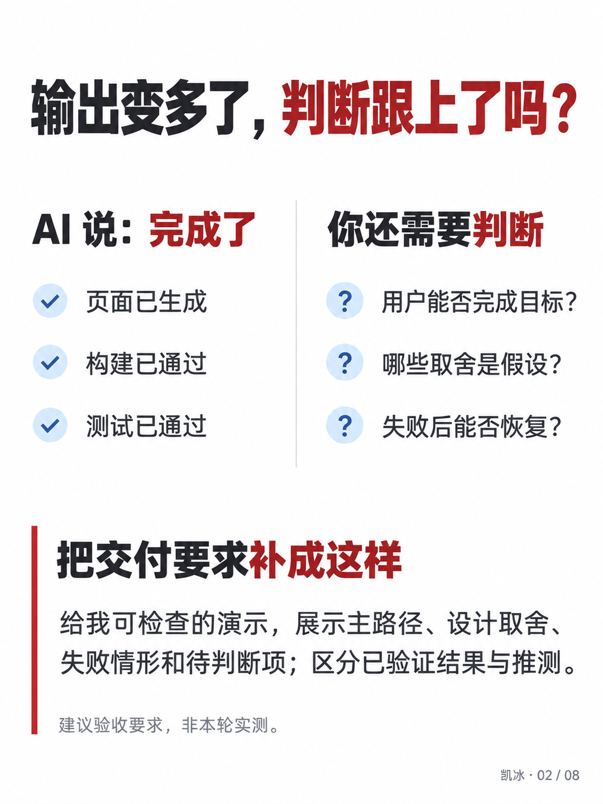
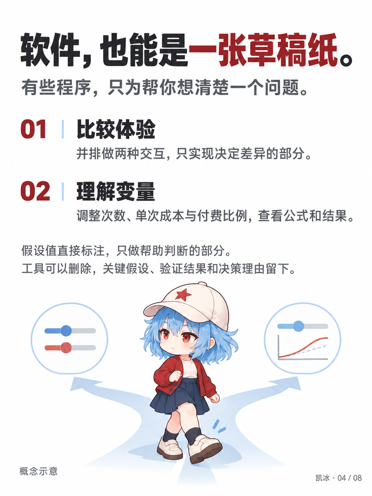
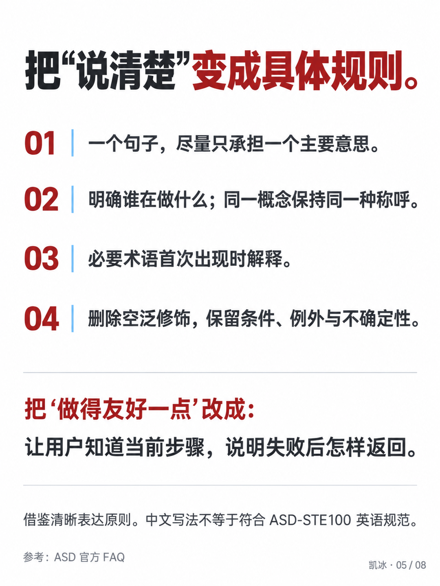
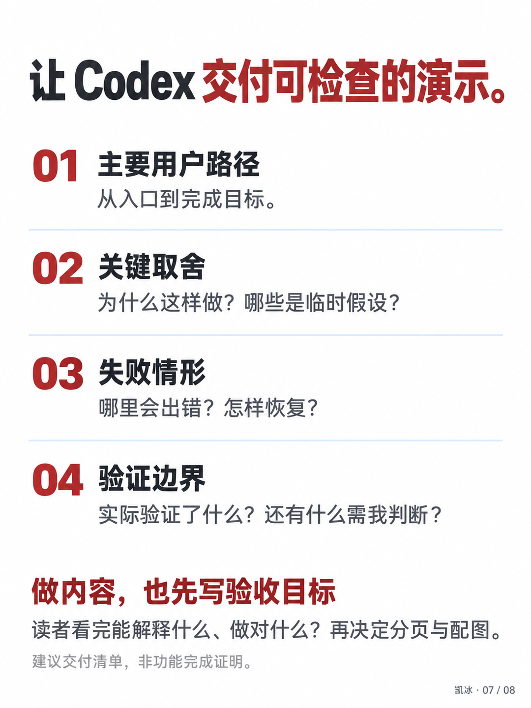
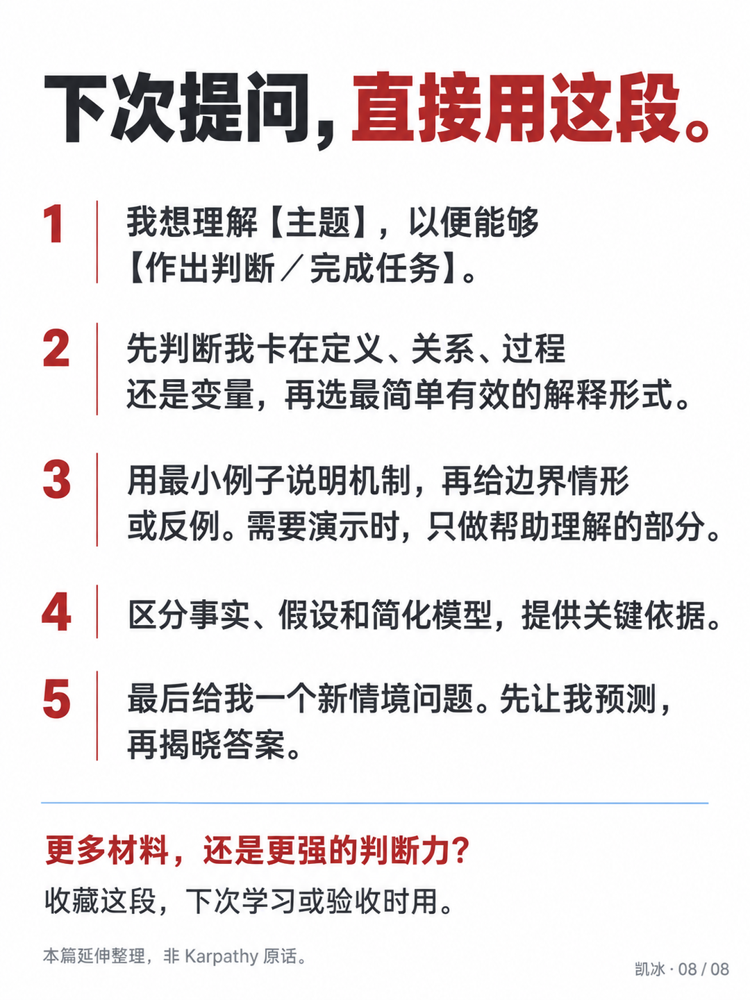
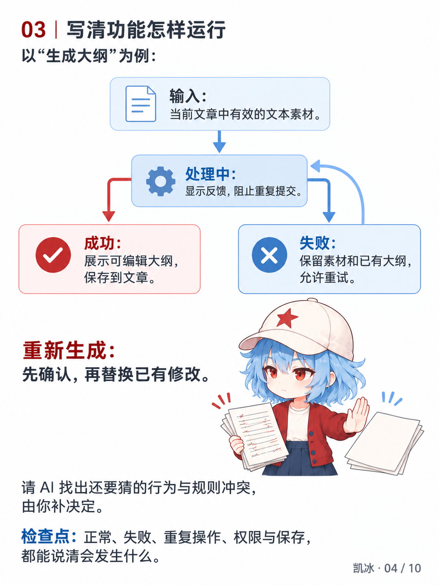

<div align="center">

# 凯冰小红书图文

### Kaibing XHS Images

**把文章、观点与工具素材，变成有凯冰辨识度的小红书图文。**

白底编辑排版 · Q 版角色参与 · 封面与内页统一表达


[看实际效果](#实际效果) · [安装](#项目级安装) · [开始使用](#开始使用) · [出图条件](#出图条件与边界)

</div>

---

## 实际效果

以下是已实际生成、核对并经作者确认的 **「凯冰白底编辑图文 v1」**。示例选题：《AI 做完了，你看懂了吗？》。

<table>
<tr>
<td align="center" width="33%"><br><strong>封面吸引注意</strong><br><sub>大标题 × 凯冰 × 主题对象</sub></td>
<td align="center" width="33%"><br><strong>内页讲清信息</strong><br><sub>对应关系 × 具体例子 × 清楚层级</sub></td>
<td align="center" width="33%"><br><strong>角色参与理解</strong><br><sub>人物动作 × 本页观点 × 阅读路径</sub></td>
</tr>
</table>

<details>
<summary><strong>展开查看其余 5 张：对比、选择、规则、验收、提问模板</strong></summary>
<br>
<table>
<tr>
<td align="center"><br><sub>理解与验收</sub></td>
<td align="center"><br><sub>软件草稿纸</sub></td>
<td align="center"><br><sub>清晰表达规则</sub></td>
</tr>
<tr>
<td align="center"><br><sub>Codex 验收清单</sub></td>
<td align="center"><br><sub>可直接使用的提问模板</sub></td>
<td></td>
</tr>
</table>

</details>

这些是**加入凯冰 IP 后的定制成果**。随包保存为视觉参考，新主题的文案、分页、动作和构图重新设计。

v1.1.0 已加入[内容表达与构图改进](kaibing-xhs-images/references/editorial-content.md)：内页保留完整解释与具体例子，标题贴近正文尺度，图像承担选择、过程或关系信息。上面的八页保留为历史视觉参考。2026-10-07用户认可内容驱动构图与角色参与的新方向；当前固定清爽配色、正文层级与角色身份，页面空间随内容关系安排。新制作验证样例记录认可范围，逐页质量仍需实际验收。

### v1.2.0 封面构思与已认可样图


2026-10-08 用户认可这张测试封面并要求固定发布。新增[封面构思方法](kaibing-xhs-images/references/cover-concept.md)：从文章承诺选择成果、事件、场景或主题审美，安排角色、素材与标题主次，并检查缩略图。主题材质有内容依据时可变化；内页继续保持清楚的阅读系统。

样图实际检查了文字、身份、动作和 240px 阅读，保留 1086×1448 原图作参考。图纸细线与小署名较弱，验收主要由标题和检查符号表达；认可这一张不等于所有新选题已验证。[认可范围与来源](kaibing-xhs-images/assets/approved-cover-v1/manifest.json)。新文章重新构思，不照搬该场景。

### 当前构图验证



这张制作样例用分支表达功能行为，用凯冰的动作解释覆盖前确认；只适用于相应关系。已核对完整文案与360px预览，用户认可的是方向，未将其记为逐张确认。[来源与验证范围](kaibing-xhs-images/assets/composition-examples/manifest.json)。

## 它能帮你完成什么

输入一篇文章、一组观点或工具素材，助手通过这个 Skill 安排内容与画面，调用当前可用的图像工具完成制作。

| 你提供 | Skill 组织 | 最终交付 |
|---|---|---|
| 文章、笔记、主题与观点 | 主线提炼、读者目标、封面钩子、逐页文案 | 封面与内容页图片、配文 |
| 项目介绍、真实截图与体验 | 信息优先级、步骤、对比、证据标注 | 工具介绍、教程或体验图文 |
| 已有图文与修改意见 | 调整指定页的层级、内容、人物关系 | 新候选图片与修改记录 |

默认推荐 **2–10 页**，也可按用户要求确定页数。每页承担一个主要任务，保留具体信息；内容不够时减少页数。

## 凯冰特色如何融入

| 维度 | 默认表达 |
|---|---|
| **整套气质** | 白底、深灰文字，暗红强调、冰蓝辅助；留白充分、少装饰 |
| **封面** | 大标题；Q 版凯冰与一个主题对象形成动作或选择关系 |
| **内页** | 标题明显小于封面；允许完整段落，按内容使用场景、对比、关系图、真实证据、清单或模板 |
| **人物出现** | 按当前事件参与提问、选择、体验或验证；真实证据保持清楚 |
| **身份一致** | 实际传入原始 Q 版参考，保留白帽红星、冰蓝短发、暗红开衫 |
| **作者署名** | 克制的 `凯冰 · NN / TOTAL` 页脚 |
| **画幅尺寸** | 3:4 竖版；最终等比整理为 1080×1440 |

人物参考负责锁定身份，当前内容决定姿势与构图。对于解释型角色场景，规划时会检查：**去掉凯冰，本页会失去什么理解线索、选择关系或动作张力？**

随后检查具体事件、目光、手与对象的接触，以及分类、状态和结果是否对应。结尾完成当篇的总结或可用内容，当前不自动追加固定品牌尾页。

基础能力改装自 `baoyu-xhs-images` 2.0.1，保留 **12 种风格、8 种布局**；明确要求时可选择其他风格，凯冰身份继续保持。

## 项目级安装

在目标项目目录执行：

```bash
git clone https://github.com/ruijayfeng/kaibing-xhs-images.git
mkdir -p .agents/skills
cp -R kaibing-xhs-images/kaibing-xhs-images .agents/skills/
```

安装后入口应为：

```text
你的项目/.agents/skills/kaibing-xhs-images/SKILL.md
```

已有同名 Skill 时先备份再更新。重新载入项目或开启新会话，让助手发现 Skill。

也可从 [Releases](https://github.com/ruijayfeng/kaibing-xhs-images/releases) 下载 ZIP，将解压后的内部 `kaibing-xhs-images/` 目录复制到目标项目的 `.agents/skills/`。

本次更新为 v1.2.0，main 与对应 Release ZIP 包含同一套规则；旧版 ZIP 保留发行时内容。

<details>
<summary><strong>默认偏好与项目配置</strong></summary>

新项目没有配置时，读取[随包默认偏好](kaibing-xhs-images/references/config/default-preferences.md)：中文、凯冰白底编辑风格、按内容选择构图、轻量署名和顺序出图。

如需保存或调整偏好，使用项目路径：

```text
.baoyu-skills/kaibing-xhs-images/EXTEND.md
```

已有配置继续生效。用户明确要求优先；本包流程只读写项目配置。

</details>

## 开始使用

### 先做一张封面

```text
使用 $kaibing-xhs-images，把下面内容做成小红书图文。
面向 AI 科技读者，沿用固定的凯冰白底编辑风格，先出封面。

<粘贴内容>
```

### 文案与整套图片一起出

```text
使用 $kaibing-xhs-images，按已确认的凯冰风格制作下面内容。
文案和整套图片一起出，重点解释原理与边界，页数按内容确定。

<粘贴内容>
```

### 只规划，或修改指定页面

```text
使用 $kaibing-xhs-images，只给出逐页文案和视觉规划，先不生图。
```

```text
使用 $kaibing-xhs-images，调整第 3 页：标题缩小，增加一个具体例子。
保留凯冰身份、配色和署名，重新出这一页。
```

默认先出新主题样张。明确授权整套时，检查样张后继续完成；已确认的偏好和当前任务授权会复用。

## 制作流程

| 阶段 | 具体动作 |
|---|---|
| **理解内容** | 提炼主线、读者问题、完整解释与需要说明的边界 |
| **安排页面** | 写逐页完整文案与画面贡献，按信息关系选择布局 |
| **构思画面** | 确定凯冰是否出现、具体动作及主题对象 |
| **准备出图** | 保存正文与图内标签，实际传入身份图及适合当前关系的可选风格图 |
| **生成检查** | 核对正文和标签、人物动作、关系方向与手机阅读；已知问题修订后再交付 |
| **整理交付** | 保存独立图片、配文、提示词、参考来源与生成记录 |

真实截图、官方案例、本轮生成结果、个人判断与概念示意在规划和制作记录中区分，正文准确表达。正式画面不自动添加“概念示例”等制作标签；必要的来源署名可以保留，真实材料缺失时在规划中记录待补。

出图前运行随包的 `scripts/check_publish_copy.py` 检查逐页文案，避免把制作标签带上图；必要的读者说明仍可保留，并在规划中记录说明原文与原因。完整文案只在 `Text Content` 维护，生成后仍须逐字核对图片。

## 出图条件与边界

**Skill 组织需求、分页和工具调用。实际生成图片，需要当前环境中可用的图像工具。**

| 项目 | 当前状态 |
|---|---|
| 已测试路径 | 支持 `referenced_image_paths` 的 Codex 内置图像工具，实际完成本页展示的八页样例 |
| 额外密钥 | 上述测试未新增 API 密钥；每次运行仍检查工具、权限与额度 |
| 其他环境 | 先核对出图与角色参考输入能力；缺少时明确说明阻塞点 |
| 中文文字 | 当前样例采用整页生成，字形由模型绘制，逐页核对错字与可读性 |
| 真实字体 | 需要确定文字或保留真实截图时，可用当前可用字体整页排版；新插画先生成无字母版 |
| 一致性 | 使用身份与风格参考，并检查新结果；新主题可能需要迭代 |
| 发布 | 交付图文文件，由用户审查和发布 |

本包不附带 API 服务、密钥、CLI 出图后端或自动发布工具。新增付费服务和密钥配置需用户授权。

## 仓库内容

```text
.
├── README.md
├── LICENSE
├── NOTICE.md
├── LICENSES/                    # 保留的上游许可
└── kaibing-xhs-images/           # 可独立安装的 Skill
    ├── SKILL.md
    ├── LICENSE
    ├── scripts/                # 发布文案预检与回归检查
    ├── references/
    │   ├── approved-style.md    # 已确认的视觉基准
    │   ├── editorial-content.md # 完整解释、图文分工与验收
    │   ├── kaibing-integration.md
    │   ├── config/             # 默认偏好与配置格式
    │   ├── kevinbee/           # 原始角色规范快照
    │   ├── workflows/          # 分析、分页与提示词
    │   ├── presets/            # 12 种风格
    │   ├── palettes/
    │   └── elements/           # 布局、文字与视觉元素
    └── assets/
        ├── identity/           # 1 张实际使用的 Q 版身份参考
        ├── approved-style-v1/  # 8 张历史确认样例与清单
        └── composition-examples/ # 新方向制作验证与认可范围
```

只收录这个 Skill 的必要资料；没有带入其他 Skill、原文章、测试日志、备份、环境目录、本机路径或密钥。

**规则入口**：[Skill](kaibing-xhs-images/SKILL.md) · [内容表达](kaibing-xhs-images/references/editorial-content.md) · [凯冰集成](kaibing-xhs-images/references/kaibing-integration.md) · [视觉基准](kaibing-xhs-images/references/approved-style.md) · [默认配置](kaibing-xhs-images/references/config/default-preferences.md)

## 来源与许可

- **内容与布局基础**：[Jim Liu / baoyu-skills](https://github.com/JimLiu/baoyu-skills)，基础版本 2.0.1。
- **角色身份与参考**：[KevinBee Illustrations](https://github.com/ruijayfeng/kevinbee-illustrations)，凯冰（KevinBee）。
- **上游方法来源**：KevinBee Illustrations 从 [Ian Xiaohei Illustrations](https://github.com/helloianneo/ian-xiaohei-illustrations) 的文章配图方法演化，保留相应署名。

按 [MIT License](LICENSE) 分发；完整来源说明见 [NOTICE.md](NOTICE.md)，原始上游许可保留在 `LICENSES/`。

---

<div align="center">

**凯冰 · KevinBee**

让封面抓住主题，让内页讲清内容，让角色参与表达。

</div>
